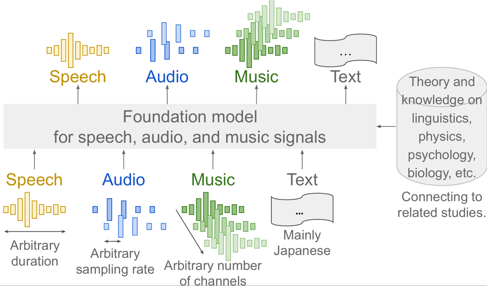

# Dataset list for Audio Foundation model / 音声・音響・音楽の基盤モデルのためのデータセットリスト
In order to construct a general-purpose speech-audio-music foundation model and share its knowledge, a dataset that contributes to its construction should be developed in a reproducible form. This repository provides a list of publicly available datasets as well as meta-information and where to obtain them.

汎用的な音基盤モデルを構築してその知見を共有するには，構築に資するデータセットを再現可能な形で整備すべきである．本リポジトリでは，パブリックに入手可能なデータセット一覧とともに，そのメタ情報や入手先を提供する．

## Directory structure / ディレクトリ
{YYYYMM} indicates the version of lists.
- {YYYYMM}/dataset.csv: list for dataset
- {YYYYMM}/dataset_augmentation.csv: list for dataset for data augmentation

{YYYYMM} はリストのバージョンを表します．
- {YYYYMM}/dataset.csv: データセットのリスト
- {YYYYMM}/dataset_augmentation.csv: データ拡張用のデータセットのリスト

## Our aim / 我々の狙い
Our aim to the foundation model is as follows.
- Be able to treat speech, acoustics, and music in a unified manner
- Ability to handle arbitrary values for time length, sampling frequency, and number of channels
- Be able to connect to adjacent fields such as linguistics, physics, psychology, biology, etc
- Must be able to handle Japan or the Japanese language
- Must open up audio research to a wide range of fields

基盤モデルに向けた我々の狙いは以下のとおりである．
- 音声・音響・音楽を統一に扱えること
- 時間長，サンプリング周波数，チャネル数について任意の値を扱えること
- 言語学，物理学，心理学，生物学などの隣接分野に接続できること
- 日本あるいは日本語を扱えること
- 音研究を多分野に広く開放できること

## Dataset list / データセットリスト
We are welcome to register new datasets! Please make issue and let us know the following information.
- label: dataset label
- corpus name: full name of the dataset
- sound type: speech, audio, or music
- num channels: the number of channels of audio files
- sampling rate \[kHz\]: sampling rate.
- compression: If True, the audio file is compressed, e.g., MP3.
- SNR \[dB\]: signal-noise ratio. "w/" means that the detail is not specified in the dataset but noise is included. "w/o" meand dry source.
- RT60 [ms]: reverberation time. "w/" means that the detail is not specified in the dataset but reveberation is included. "w/o" meand dry source.
- Duration \[h\]: Duration of audio files.
- Language: language IDs of the dataset. In "eng" case, for example, transcriptions, captions, or other meta information is written in English.
- project page link: project page of the dataset.
- download link: a link to download the dataset.

データセットの追加は大歓迎です！イシューを立てて以下の情報を教えてください．
- label: データセットのラベル
- corpus name: データセットの正式な名前
- sound type: 音の種類（音声，音響，音楽）
- num channels: 音ファイルのチャネル数
- sampling rate \[kHz\]: 音ファイルのサンプリング周波数
- compression: 音ファイルが圧縮音源（例えばmp3）か否か
- SNR \[dB\]: 信号雑音比．"w/" は,詳細は不明だが雑音が混入している．"w/o" はドライソース．
- RT60 [ms]: 残響時間．"w/" は，詳細は不明だが残響がある．"w/o" はドライソース．
- Duration \[h\]: 音ファイルの時間長．
- Language: 言語ID. 例えば "eng" なら，書き起こし，キャプション，あるいはそれ以外の情報が英語で書かれている．
- project page link: データセットのプロジェクトページ
- download link: データセットをダウンロードするリンク

## Update history / 更新履歴
- ver.202501 ... first release

## Contributors / 貢献者
- Shinnosuke Takamichi (Keio University, UTokyo, AIST) / 高道 慎之介（慶大，東大，産総研）
- Aogu Wada (UTokyo) / 和田 仰（東大）
- Ryo Ogawa (UTokyo) / 小川 諒（東大）
- Kouei Yamaoka (UTokyo) / 山岡 洸瑛（東大）

## Papers / 論文
- 高道 慎之介, 和田 仰, 小川 諒, 山岡 洸瑛, 中田 亘, 淺井 航平, 関 健太郎, 岡本 悠希, 齋藤 佑樹, 小川 哲司, 猿渡 洋, 中村 友彦, 深山 覚, "音声・音響・音楽を扱うオープン基盤モデルの構築に向けたデータセット策定," 言語処理学会年次大会, 2025.

